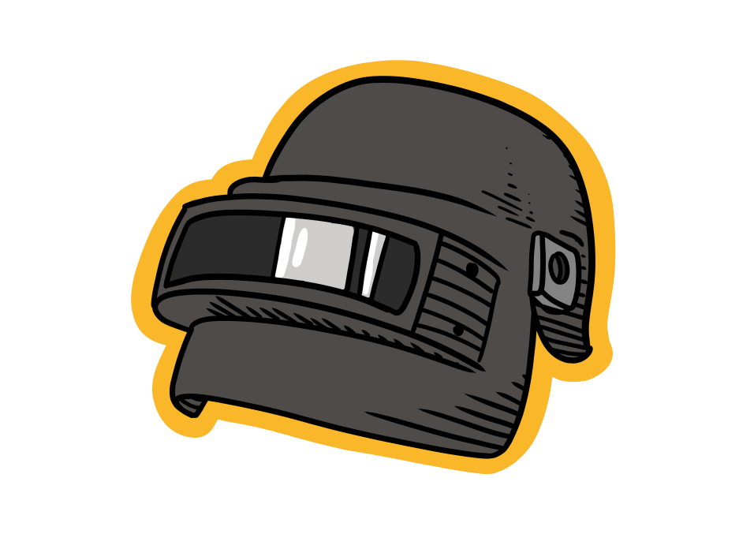

<p align="center"></p>

<p align="center">
  </a>
</p>

<h2 align="center">PUBG Discord Bot</h2>
<p align="center">A discord bot to view stats and overview from PUBG</p>

### Install the dependencies
```bash
pip install -r requirements.txt
```

### Add your secrets
Rename `example_secret.json` to `secrets.json` and add your secret to the file.

### Run bot
```bash
python bot.py
```
